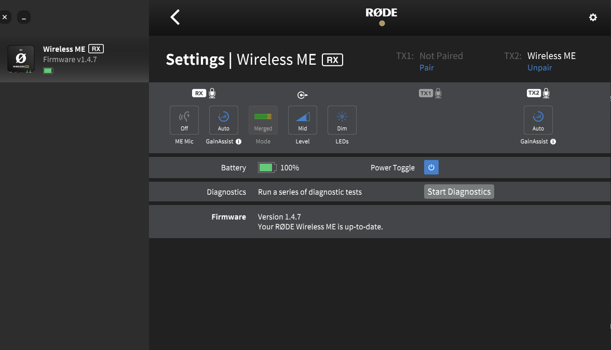
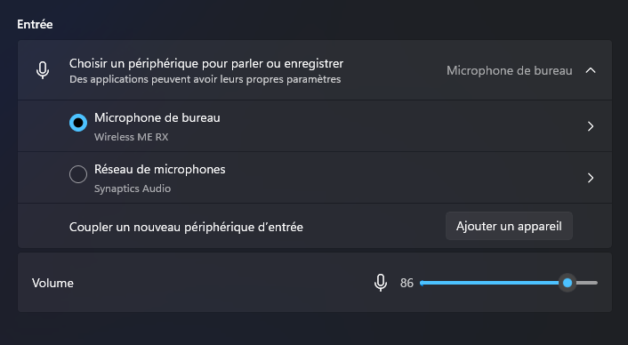
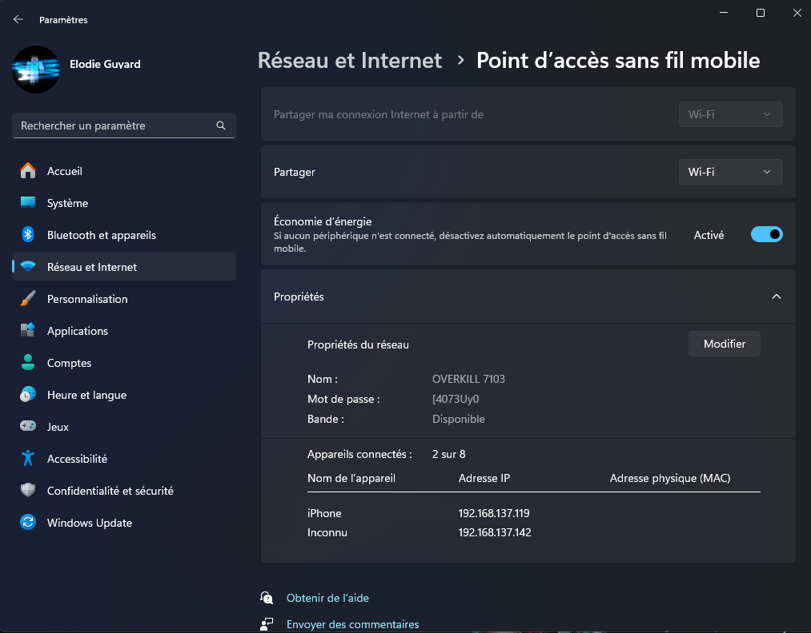
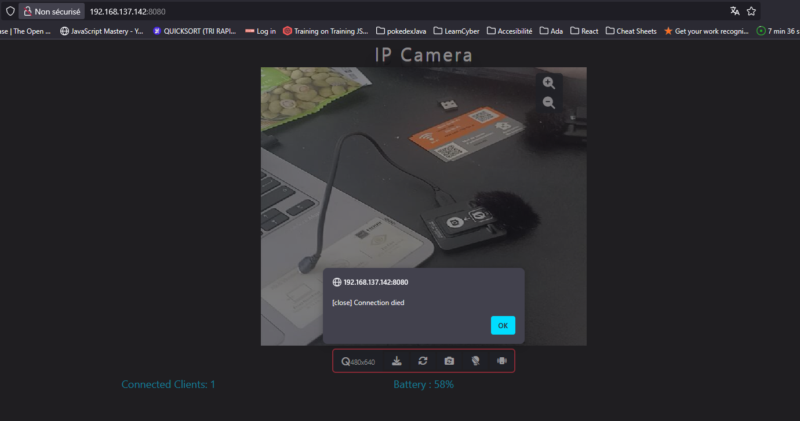

# Mode dégradé

- Enregistrement vidéo par un téléphone 
    - clapper si prise de son séparé -> enregistrement sur Ordinateur avec Rx branché sur l'ordinateur, Tx sur le speaker
    - prise de son via l'appareil (micro vers téléphone en usb C, normalement rien à faire, vérifier que le son est bien capté par le micro TX, Rx étant branché au téléphone via application VuMètre)
- récupérer le fichier ppt

-> montage vidéo pour tout synchroniser

## Matériel :

- Rode WirelessME Rx et TX
- rallonge 220V
- multiprise double minimum à clapet étanche (pour sécurité norme publique pour les assurances)
- hub USB C - USB C 
- Caméra ou téléphone
- trepied adapté

## Prise de son Rode central (Micros WireLessMe Rx/Tx)

Start diagnostic sur les deux micros (RX/TX) pour les appairer façon flem

Gain 86% windows :

# Pas pour tout de suite (pistes streaming) :
- split HDMI (pour récupérer les slides) & carte d'acquisition
- rallonge HDMI
- capture des slides via OBS avec le split hdmi & carte d'acquisition hdmi OU capture via video conférence (internet)

## OBS

- capture vidéo
- capture du son
- capture camera

Avec des scènes adaptés à l'évènement

## Point d'accès sans fil pour la caméra sans fil :

- avoir internet
- lancer le point d'accès sans fil
- une fois les connections faites : couper la connexion internet
- le point d'accès sans fil reste en foncitonnement

/!\ à la portée 5GHz Wifi

# Mode moins dégradé :

## Matériel :

- Carte d'acquisition HDMI vers usb C : https://www.amazon.fr/gp/product/B0C2CJPV8D/ref=ewc_pr_img_4?smid=A3FBQ7GN3Z1KSY&th=1
- câble HDMI LONG qui prends en charge le son : https://www.amazon.fr/gp/product/B07VNSR69X/ref=ewc_pr_img_3?smid=A1X6FK5RDHNB96&th=1
- splitter HDMI pour la sortie audio/vidéo de la machine Speackeuse : https://www.amazon.fr/gp/product/B0DLNW4VF1/ref=ewc_pr_img_1?smid=A1SF02M8IRPNMQ&psc=1
- HDMI audio extractor : https://www.amazon.fr/gp/product/B0DY7LN2K8/ref=ewc_pr_img_1?smid=A37CS93AQIQFHM&th=1
- Rode WirelessME Rx et TX
- rallonge 220V
- Caméra ou téléphone
- trepied adapté
- multiprise double minimum à clapet étanche (pour sécurité norme publique pour les assurances)

## Prise de son Rode central (Micros WireLessMe Rx/Tx)

Start diagnostic sur les deux micros (RX/TX) pour les appairer façon flem

Gain 86% windows :

## Câblage
Sortie Machine de la Speackeuse :
- splitter HDMI -> OUTPUT 1 -> HDMI audio extractor audio/video (pour avoir le son de la machine sur nos hauts parleurs pour le public) -> raccorder le projecteur 
- splitter HDMI -> OUTPUT 2 -> câble HDMI 10mètres vers la machine enregistreuse

## Machine enregistreuse : dans OBS

- récupérer source audio/vidéo machine Speackeuse ( à tester dans OBS si le son de la machine vient avec !!!!!!!! )
- source audio micro cravatte ( au pire record via Audacity )
- vidéo caméra Speackeuse téléphone via caméra IP (non- obligatoire pour des raisons de qualité vidéo) -> clapper à la place et synchro au montage
